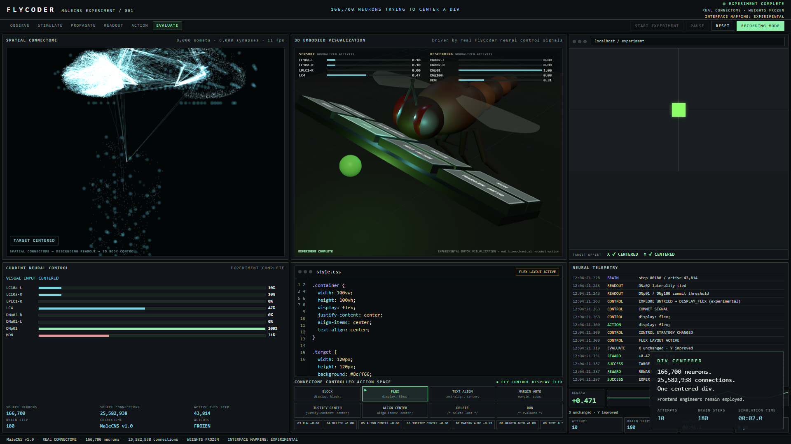
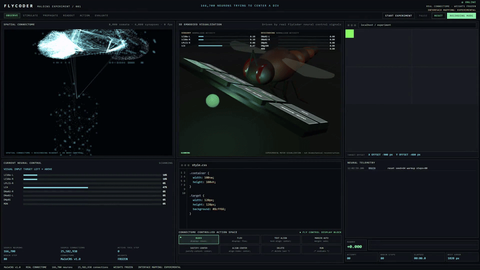
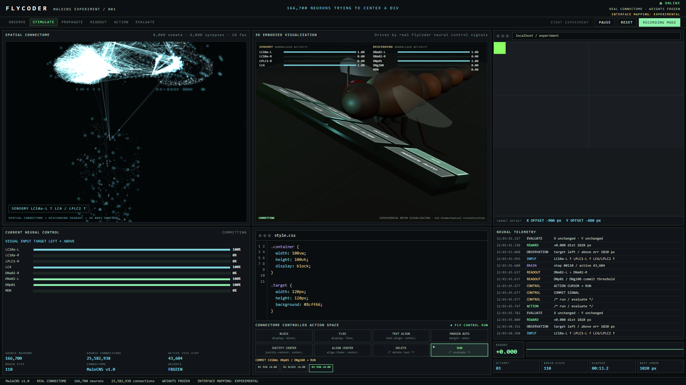
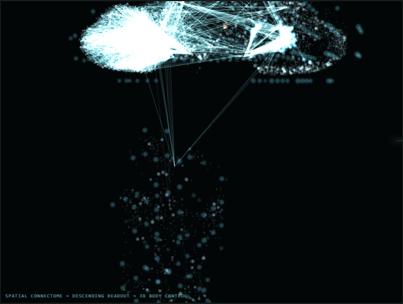
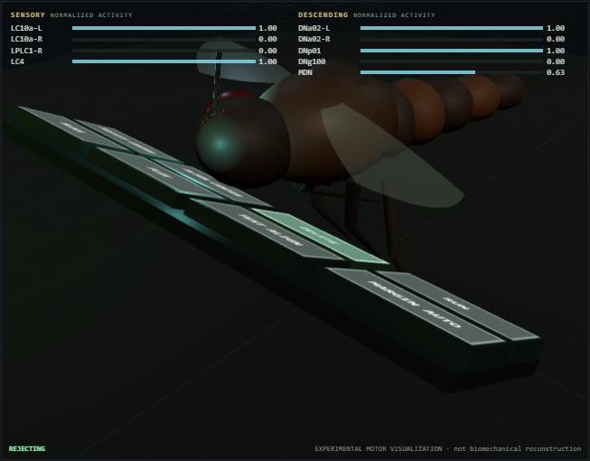
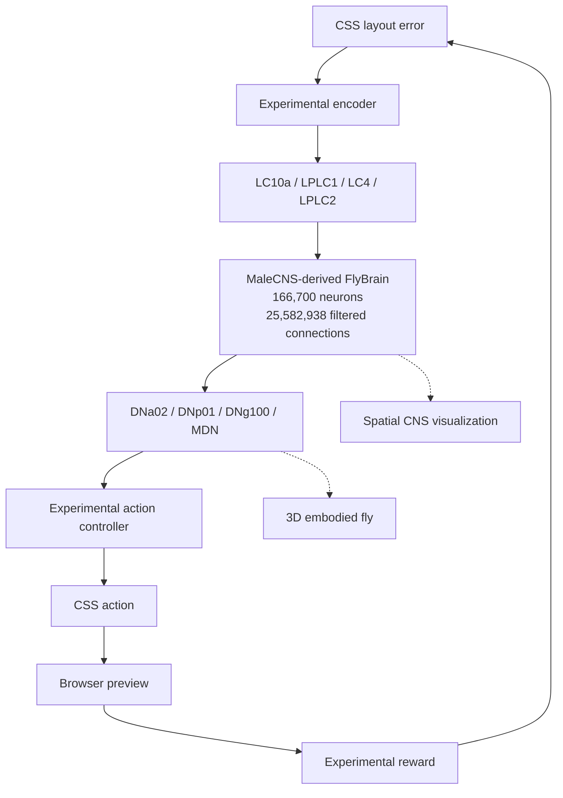

# 🪰 FlyCoder

> **166,700 fruit fly neurons trying to center a div.**

Real connectome. Experimental interface. One centered div.

[](https://www.python.org/)
[](LICENSE)
[](https://github.com/tolga-ileri/FlyCoder/stargazers)

<p align="center">
  
</p>

<p align="center"><em>MaleCNS-derived FlyBrain activity driving an experimental CSS layout task.</em></p>

[Demo video](docs/media/flycoder-demo.mp4) · [Release](https://github.com/tolga-ileri/FlyCoder/releases)

FlyCoder does **not** claim that Drosophila neurons understand CSS.

---

## Demo

A real Recording Mode run: neural activity → selector → wing keypress → CSS → the square moves.

<p align="center">
  
</p>

If the GIF is missing or too large on GitHub, watch [`docs/media/flycoder-demo.mp4`](docs/media/flycoder-demo.mp4).

| | |
|---|---|
|  |  |
|  |  |

---

## What is FlyCoder?

FlyCoder is a closed-loop experiment on top of fly.ai `FlyBrain`. It does **not** replace, retrain, or rewrite the MaleCNS connectome. Weights stay frozen.

What is new is an **experimental interface**: a CSS viewport, a sensory encoder onto identified visual projection neurons, a descending-neuron action cursor, a live dashboard, and a 3D embodied visualization of the same control signals.

The fly does not write CSS. The connectome drives a controller whose actions *correspond* to CSS operations.

---

## How it works



---

## Architecture

| Layer | Role |
|---|---|
| `coder_env.py` | 1920×1080 viewport, CSS stack, layout, distance reward |
| `encoder.py` | layout error → inject onto LC10a / LPLC1 / LC4 / LPLC2 |
| `flybrain.FlyBrain` | frozen MaleCNS LIF simulation |
| `decoder.py` | descending groups → LEFT / RIGHT / COMMIT / REJECT |
| `selector.py` | action cursor; experimental Q / idle-commit **outside** the connectome |
| `experiment.py` | closed loop; dashboard snapshots are display-only |
| `dashboard/` | spatial CNS WebGL view + procedural 3D fly + editor/preview |

---

## What is real vs experimental?

| Component | Status |
|---|---|
| MaleCNS neuron identities | Real dataset-derived |
| Connectivity used by FlyBrain | Real MaleCNS-derived connectivity |
| FlyBrain neural dynamics | Simplified leaky integrate-and-fire |
| LC10a / LPLC1 / LC4 / LPLC2 input mapping | Experimental |
| DNa02 / DNp01 / DNg100 / MDN activity | Real simulated spikes |
| Interpretation of those spikes as coding UI | Experimental |
| CSS action meanings | Experimental |
| Reward | Experimental (distance-to-center improvement) |
| Q table / idle-commit fallback | Experimental; not connectome weights |
| Spatial CNS view | Real soma coordinates + sampled real edges |
| Full neurite morphology | **Not included** |
| 3D fly body | Visualization |
| Wing keyboard interaction | Embodied visualization, not biomechanics |

FlyCoder does **not** claim that Drosophila neurons understand CSS.

The 3D fly is an embodied visualization of FlyCoder's neural control signals and is **not** a biomechanically complete Drosophila simulation.

The connectome view uses real MaleCNS soma positions and sampled connectivity. It does **not** display complete neuron morphology.

---

## Neural mappings

DNa02 laterality is interpreted by FlyCoder as a **generic left/right control channel**. It is not “CSS left.”

### Sensory (experimental encoding onto real types)

| FlyCoder signal | Types | Side | Interface meaning |
|---|---|---|---|
| TARGET_LEFT | LC10a | L | square left of center |
| TARGET_RIGHT | LC10a | R | square right of center |
| TARGET_UP | LPLC1 | L | square above center (experimental vertical) |
| TARGET_DOWN | LPLC1 | R | square below center |
| ERROR_MAGNITUDE | LC4 + LPLC2 | L+R | distance from center as looming intensity |

Same visual projection types `flybrain/eyes.py` uses for other fly.ai tasks.

### Descending (real activity, experimental readout)

| Control channel | Groups | Types | Interface meaning |
|---|---|---|---|
| LEFT | `steer_L` | DNa02 | move action cursor left |
| RIGHT | `steer_R` | DNa02 | move action cursor right |
| COMMIT | `escape_*`, `forward_*` | DNp01, DNg100 | execute the highlighted action |
| REJECT | `backward_*` | MDN | delete last CSS action |

These are control cables, not CSS tokens.

---

## Spatial connectome visualization

The left panel is a **spatial connectome visualization**, not a neuron reconstruction.

Measured from the loaded MaleCNS-derived `brain.positions` (soma or to-soma EM voxels):

- 166,700 source neurons
- **140,638** with finite xyz
- no SWC / skeleton / neurite geometry in this repository or the local FlyBrain files

The renderer rigidly normalizes those coordinates (percentile clip, isotropic scale, L/R flip so left is left). There is **no** force-directed or random layout.

Frontend sample (see `flycoder/config.py`):

- 8,000 visible somata
- 6,000 sampled real synapses among those somata
- occupancy density shell from **all** mapped somata

Source neuron indices stay attached to displayed nodes.

---

## 3D embodied visualization

Original procedural adult Drosophila built from Three.js primitives in `flycoder/dashboard/fly3d.js`. No third-party character mesh is shipped.

| Signal | Motion (visualization only) |
|---|---|
| DNa02 L vs R | yaw, hover bias, selector highlight |
| DNp01 / DNg100 COMMIT | lean + wing tap on the selected key |
| MDN REJECT | pull back + backward wing sweep + DELETE flash |
| RUN | both wings tap |
| Idle antenna / abdomen / legs | procedural interpolation |

COMMIT contact is synced on the frontend so CSS typing starts after the wing hits the key. The neural decision itself is not delayed.

The 3D body's wing/pose animations are an embodied visualization of FlyCoder's neural control channels. They are not a biomechanical simulation of Drosophila motor physiology.

---

## Installation

```sh
git clone https://github.com/tolga-ileri/FlyCoder.git
cd FlyCoder
python -m venv .venv
```

Windows:

```powershell
.venv\Scripts\activate
```

macOS / Linux:

```sh
source .venv/bin/activate
```

```sh
pip install -r requirements.txt
python -m flybrain download
python -m flycoder
```

Then open [http://127.0.0.1:8788/](http://127.0.0.1:8788/).

Python 3.10+ (verified on Windows / Python 3.13). A multi-core CPU is recommended. NVIDIA CUDA is optional (`pip install -r requirements-gpu.txt`, then `--device cuda`).

---

## Running FlyCoder

```sh
python -m flycoder
python -m flycoder --no-browser --port 8788
python -m flycoder --headless --seed 64
python -m flycoder --device cuda
```

`python -m flybrain download` fetches the prebuilt MaleCNS-derived network (**~260 MB**, once) into `~/fly-data` or `$FLY_DATA`. This repository does **not** contain the connectome dataset.

First dashboard load maps the connectome for visualization and can take tens of seconds on CPU.

Release media was captured with `python scripts/capture_release_media.py` against a live dashboard (Playwright + ffmpeg). The script is optional; it is not required to run FlyCoder.

---

## Recording mode

`R` locks cameras and slows **presentation** between real observation cycles (~25–40 s visible clip). The brain still computes at full speed. The dashboard interpolates spikes between published snapshots.

---

## Controls

| Key | Action |
|---|---|
| Space | Start / pause |
| R | Recording Mode |
| S | Screenshot chrome (after success) |
| Esc | Reset |

---

## Reproducibility

Headless, seed `64` (re-run before this release):

```text
centered=True
attempts=10
brain_steps=180
reward=1.0
```

`BRAIN_STEPS_PER_ACTION` is 10. Knobs live in [`flycoder/config.py`](flycoder/config.py).

---

## Performance

FlyBrain stepping is separate from the two WebGL views.

Dashboard FPS depends on machine and browser. Under Cursor's embedded browser with both the spatial CNS view and the 3D fly running, this project measured about **30–43 FPS**. Do not assume 60 FPS.

The connectome panel is a **sample** of soma positions and edges so the UI can stay interactive. It is not 166,700 DOM nodes.

---

## Project structure

```text
FlyCoder/
├── flybrain/                 # frozen MaleCNS LIF (upstream fly.ai)
├── flycoder/
│   ├── experiment.py         # closed loop
│   ├── encoder.py / decoder.py / selector.py / coder_env.py
│   └── dashboard/            # 1920×1080 lab UI, WebGL, favicons
├── docs/media/               # real screenshots and demo capture
├── scripts/capture_release_media.py
├── NOTICE                    # licenses and attribution
└── README.md
```

---

## Scientific context

FlyCoder is a desktop demo, not peer-reviewed science and not a biological emulation. Point neurons, one global LIF recipe, transmitter sign from a simple rule, and an experimental visual front end that injects identified projection neurons rather than simulating the eye.

Limitations of FlyBrain itself are documented in the [fly.ai](https://github.com/alextitonis/fly.ai) project this package comes from.

---

## Limitations

- The fly does not understand CSS, layout, or “centering a div.”
- Encoder / decoder / reward / Q-idle are experimental interface code.
- No full neuron morphology.
- No biomechanical body.
- Results are for this mapping and this seed, not a claim about Drosophila cognition.

---

## Attribution

- **Connectome:** MaleCNS v1.0, FlyEM (HHMI Janelia), University of Cambridge, MRC LMB, and Google Research. [CC BY 4.0](https://male-cns.janelia.org/download/).
- **Simulation:** fly.ai `FlyBrain` (MIT), Copyright (c) 2026 alextitonis. Neuron model adapted from [Fly64](https://github.com/ornata/fly).
- **3D renderer:** [Three.js](https://github.com/mrdoob/three.js) r160 (MIT), vendored in `flycoder/dashboard/vendor/three.min.js`.
- **3D fly:** original procedural model in this repository. No DeepMind or other third-party character assets.
- **Icon:** original FlyCoder mark in `flycoder/dashboard/flycoder-icon.svg`.

FlyCoder is an independent experimental project and is **not affiliated** with Google, Google DeepMind, HHMI Janelia, or the MaleCNS authors.

---

## License

Code in this repository is MIT. See [`LICENSE`](LICENSE) and [`NOTICE`](NOTICE).

MaleCNS data is **not** stored here; it remains under CC BY 4.0.

---

## Acknowledgements

Thanks to the MaleCNS teams for releasing the connectome, to alextitonis / fly.ai for FlyBrain, and to Jessica Paquette (Fly64) for the neuron-model recipe this simulation follows.

---

## References

1. Berg, S. et al. (2026). Sexual dimorphism in the complete connectome of the *Drosophila* male central nervous system. *Cell*. Data: [male-cns.janelia.org](https://male-cns.janelia.org)
2. [MaleCNS download / attribution](https://male-cns.janelia.org/download/)
3. [fly.ai / FlyBrain](https://github.com/alextitonis/fly.ai)
4. Paquette, J. [Fly64](https://github.com/ornata/fly)
5. Dorkenwald, S. et al. (2024). Neuronal wiring diagram of an adult brain. *Nature* 634.
